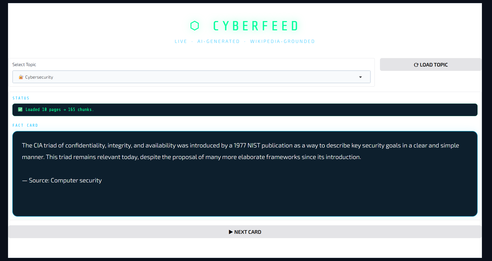
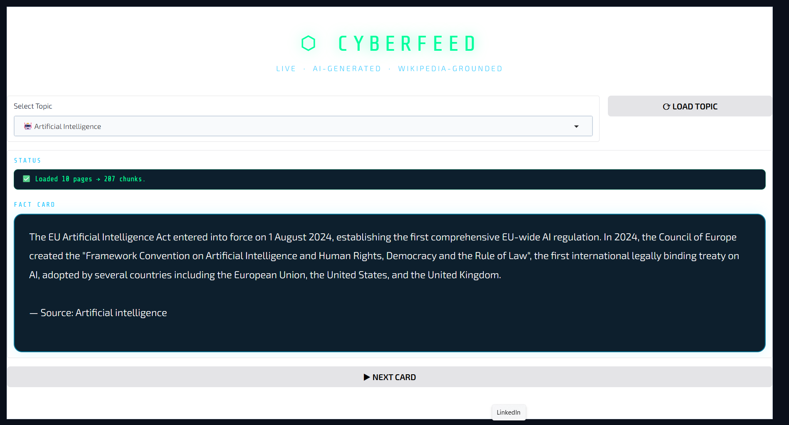
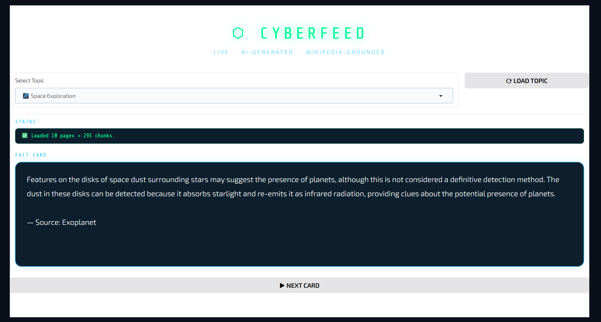

# ⬡ CyberFeed

An AI-powered endless fact-card feed that generates live cybersecurity insights from Wikipedia using the Groq API.

## How It Works
1. Wikipedia pages on the chosen topic are fetched and split into chunks
2. On each click, a random chunk is sent to the LLM
3. The model generates a fresh 1–2 sentence fact — strictly from the source material
4. Repeat forever — no two cards are the same

## Features
- 🔐 Cybersecurity, 🤖 AI, and 🌌 Space Exploration topics
- Zero hallucinations — LLM is grounded strictly to Wikipedia content
- Live generation — no pre-caching
- Clean dark-themed Gradio UI

## Setup
1. Open the notebook in Google Colab
2. Go to **Runtime → Manage secrets** and add your key:
   GROQ_API_KEY = your_key_here
3. Run all cells top to bottom
4. Click the public Gradio link to open the app

## Usage
- Select a topic from the dropdown
- Click **⟳ LOAD TOPIC** and wait for Wikipedia to load
- Click **▶ NEXT CARD** for endless facts

## Tech Stack
- [Groq API](https://groq.com) — LLaMA 3.3 70B
- [Wikipedia-API](https://pypi.org/project/Wikipedia-API/)
- [Gradio](https://gradio.app)
- Google Colab
## 📸 Screenshots

### Cybersecurity

### Artificial Intelligence

### Space Exploration

